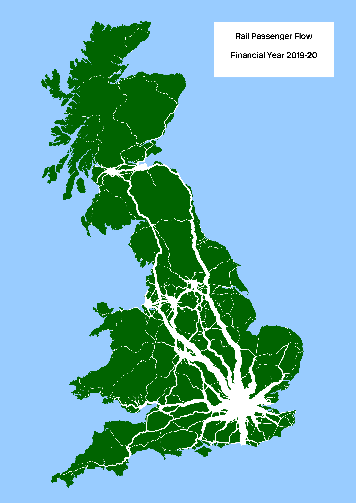
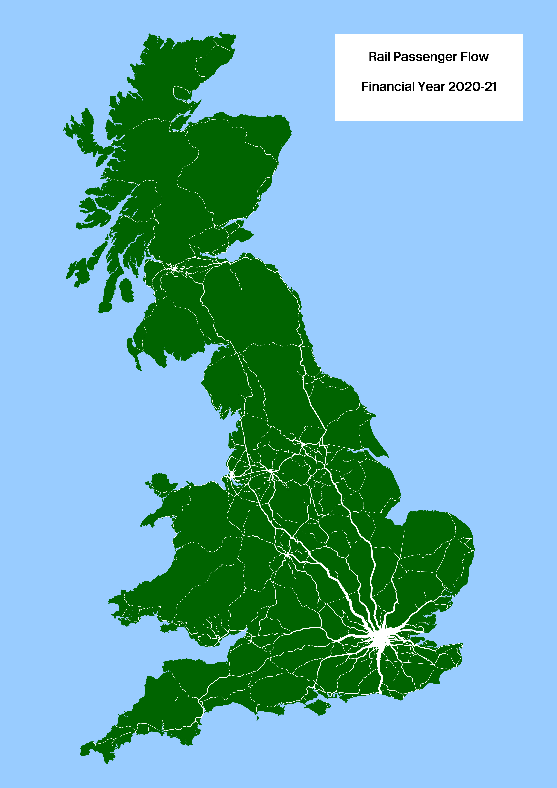

# kingfisher
Using the Office of Road and Rail (ORR) Financial Year 2018/19 to 2022/23 passenger travel data projected onto a shortest-path network using the centre-line track-model this project looks to create visualisation for passenger journey numbers for the active rail stations across the British rail network.

## Station Flow
Individual animated station flows for the five financial-years and 2 579 stations on the mainline British rail network [here](station-update.md). This is now in a **one column** format.

## Notes
This is an update following the additional publication of passenger flow data by the ORR. The original FY2021/22 [README](README-alt.md) and **two column** format view is [available here](stations.md). As well as an [OpenInnovations blog post](https://open-innovations.org/blog/2024-01-08-passenger-journeys-pictures-at-a-rail-transport-exhibition) and a Bloomberg article ["Nine Maps Show How Britain Is on the Move"](https://www.bloomberg.com/news/features/2024-02-08/british-rail-train-ticket-data-maps-show-how-a-nation-travels-before-hs2)

Station locations may change as they are now based on the ORR [Station Attributes for All-Mainline Stations](https://raildata.org.uk/dataProduct/P-f9c7e715-1367-47b0-aee3-38d73d2ebe04/dataFiles).

|Aggregated Passenger Journeys|Aggregated Passenger Journeys|
|---|---|
|||
|||
|||


## Data
All data used on the basis that it under open or permissive license

1. The base map of mainland Britain is derived from the [WorldPop](https://hub.worldpop.org) base maps under [CC 4.0 by deed](https://creativecommons.org/licenses/by/4.0/) retrieved 2023-09-07.
2. The centre-line track-model is derived from the railway-model railway-links layer (NWR Track Model) hosted by the [Rail Data Marketplace](https://raildata.org.uk/dashboard/dataProduct/P-d6c0c7ee-6743-4999-9b9e-d2dd39585bdb/dataFiles) under the [Open Government License](https://www.nationalarchives.gov.uk/doc/open-government-licence/version/3/) by Network Rail, retrieved 2024-10-12, and presented as a local copy.
3. The Origin Destination Matrix data, for example [ODM 2022-23](https://raildata.org.uk/dashboard/dataProduct/P-a839de9f-eafa-495e-92e3-ff23a33ad876/dataFiles), were published by the [Office of Road and Rail](https://raildata.org.uk/partnerDetails/1034/details) on the Rail Development Group Rail Data Market place, details under the [Open Government License](https://www.nationalarchives.gov.uk/doc/open-government-licence/version/3/). Retrieved 2024-02-18, except FY2022/23 data 2024-02-22 and FY2023/24 data 2024-11-23 as local [`bzip2`](http://www.bzip.org/) compressed copies.
4. The [Station Attributes for All-Mainline Stations (Table 6329)](https://dataportal.orr.gov.uk/statistics/infrastructure-and-environment/rail-infrastructure-and-assets/table-6329-station-attributes-for-all-mainline-stations/) was publised by the Office of Road and Rail under the [Open Government License](https://www.nationalarchives.gov.uk/doc/open-government-licence/version/3/). Retrieved 2024-11-18.
5. The [Network Rail CORPUS dataset](https://wiki.openraildata.com/index.php/Reference_Data) is an open data feed which is hosted by the [Rail Data marketplace](https://raildata.org.uk/dashboard/dataProduct/P-9d26e657-26be-496b-b669-93b217d45859/dataFiles) released under a [OGL](https://networkrail.co.uk/who-we-are/transparency-and-ethics/transparency/open-data-feeds/network-rail-infratructure-limited-data-feeds-licence/). Retrieved 2024-11-24 as a [`gzip`](https://www.gnu.org/software/gzip/manual/html_node/Overview.html) compressed local copy.
6. The National Public Transport Access Network [NaPTAN](https://data.gov.uk/dataset/3b1766bf-04a3-44f5-bea9-5c74cf002e1d/national-public-transport-gazetteer-nptg) under [OGL](https://www.nationalarchives.gov.uk/doc/open-government-licence/version/3/), and is updated each time the scripts are run.
7. While this implementation now uses NaPTAN and CORPUS to validate and identify one closed stations, the the Isle of Wight ferry-link continues to use [OpenStreetMap data](https://www.openstreetmap.org/#map=12/50.7738/-1.2607), licensed under [CC-BY-SA 2.0](https://openstreetmap.org/copyright ) through the [OverPassAPI Turbo](https://overpass-turbo.eu/) service, and is updated each time the scripts are run.


## Implementation Detail
This is likely to only be of interest if you were interested in recreating the repository yourself

### Running the Code
The repository has been updated with beta version of the code tested under `Linux Mint 21.2 Victoria` and `python 3.11`. This is then a set of details about some of the murky workings of how this hangs together.

### Installation and Execution

To execute the code on a `Linux Debian` or similar environment with a working `python3`, run the `run.sh` script:

```
   $ ./run.sh
```

This takes quite a long time. On my old kit quite few hours to complete all the processing. It then carries out a number of steps which are meant to:
* create the directory structure, 
* install required `python` dependencies in in a local `venv` virtual enviroment, 
* download additional data,
* create a station location file `work/odm-station.gpkg`,
* create a cache file `work/odm-path.gpkg` containing intermediate data layers,
* create 2 579 `GeoPKG` files for each station on the mainland network in the `output` directory,
* create a `journeys-all.gpkg` file with an aggregated total for all network segments in the model,
* create 12 895 (5 x 2 579) `PNG` image files for each station in a heirachy of directories in the `image` directory
* create 2 579 animated `GIF` image files for each station in a heirachy of directories in the `image` directory
* create a one-column `station.md` markdown file with a link to each image file

## Acknowledgment
The original travel data was kindly provided by Alasdair Rae, with the centre-line track-model by Peter Hicks through #OpenRailData. 

### License

The images in the `image` directory are under the [CC BY 4.0 license](https://creativecommons.org/licenses/by/4.0/)
The repository code and scripts are under the [Apache 2.0 license ](LICENSE)

## Thanks

Thanks is then given to WorldPop, Network Rail, the Office of Road and Rail, the Rail Delivery Group, the UK Department for Transport, the maintainers of the OverPassAPI, and all the contributors to OpenStreetMap for kindly providing their data for use in this project.
