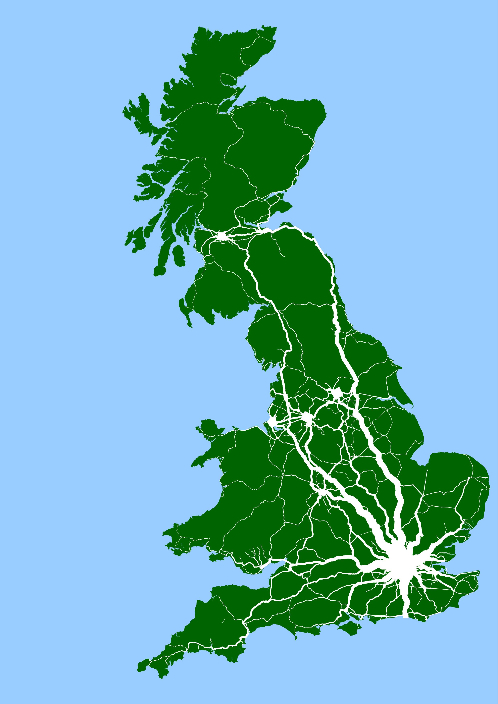
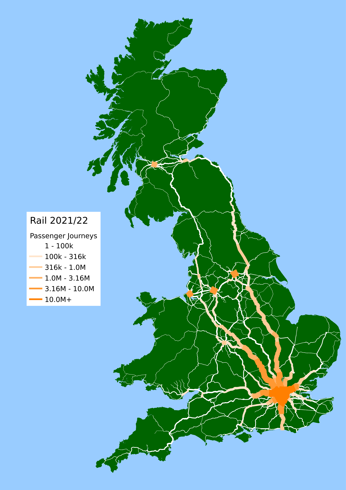

# kingfisher
Using the Office of Road and Rail 2021/22 passenger travel data projected onto a shortest-path network using the centre-line track-model this project looks to create visualisation for passenger journey numbers for the active rail stations across the British rail network.

|Aggregated Passenger Journeys|Colour Scale Passenger Journeys|
|---|---|
|||

## Station Flow
Individual station flows for the 2 567 stations on the mainline British rail network [here](station.md).

## Running the Code
The repository has been updated with beta version of the code tested under `Linux Mint 21.2 Victoria` and `python 3.11`.

### Installation and Execution

To execute the code on a `Linux Debian` or similar environment with a working `python3`, run the `run.sh` script:

```
   $ ./run.sh
```

This carries out a number of steps which to:
* create the directory structure, 
* install required `python` dependencies in in a local `venv` virtual enviroment, 
* download additional data,
* create a cache file `work/odm-path.gpkg` containing intermediate data layers
* create 2 567 `GeoPKG` files for each station on the mainland network in the `output` directory
* create a `journeys-all.gpkg` file with an aggregated total for all network segments in the model,
* create 2 567 `PNG` image files for each station in a heirachy of directories in the `image` directory
* create a two-column `station.md` markdown file with a link to each image file

## Acknowledgment
The travel data was kindly provided by Alasdair Rae with the centre-line track-model by Peter Hicks through #OpenRailData. 

### Data
All data used on the basis that it under open or permissive license

1. The base map of mainland Britain is derived from the [WorldPop](https://hub.worldpop.org) base maps under [CC 4.0 by deed](https://creativecommons.org/licenses/by/4.0/) retrieved 2023-09-07.
2. The centre-line track-model is hosted by [OpenRailData](https://github.com/openraildata/network-rail-gis) under the [Open Government License](https://www.nationalarchives.gov.uk/doc/open-government-licence/version/3/) by Network Rail retrieved 2023-07-11.
3. The Origin Destination Matrix data was published by the Office of Road and Rail on the Rail Development Group Rail Data Market place, details [here](https://raildata.org.uk/partnerDetails/1034/details) under the [Open Government License](https://www.nationalarchives.gov.uk/doc/open-government-licence/version/3/). With a variant retrieved from [AutomaticKnowledge](https://automaticknowledge.org/flowdata/) dated 2023-12-06.
4. The Network Rail CORPUS dataset is an open data feed which is released under a [OGL](https://networkrail.co.uk/who-we-are/transparency-and-ethics/transparency/open-data-feeds/network-rail-infrastructure-limited-data-feeds-licence/) retrieved 2023-11-29.
5. The National Public Transport Access Network [NaPTAN](https://data.gov.uk/dataset/3b1766bf-04a3-44f5-bea9-5c74cf002e1d/national-public-transport-gazetteer-nptg) under [OGL](https://www.nationalarchives.gov.uk/doc/open-government-licence/version/3/), and is updated each time the scripts are run.
6. OpenStreetMap data is then used to validate and also to identify 10 stations locations which is licensed under [CC-BY-SA 2.0](https://openstreetmap.org/copyright ) through the [OverPassAPI Turbo](https://overpass-turbo.eu/) service, and is updated each time the scripts are run.

### Thanks

Thanks is then given to WorldPop, Network Rail, the Office of Road and Rail, the Rail Delivery Group, the UK Department for Transport, the maintainers of the OverPassAPI, and all the contributors to OpenStreetMap for kindly providing their data for use in this project.

### License

The images in the `image` directory are under the [CC BY 4.0 license](https://creativecommons.org/licenses/by/4.0/)
The repository code and scripts are under the [Apache 2.0 license ](LICENSE)
